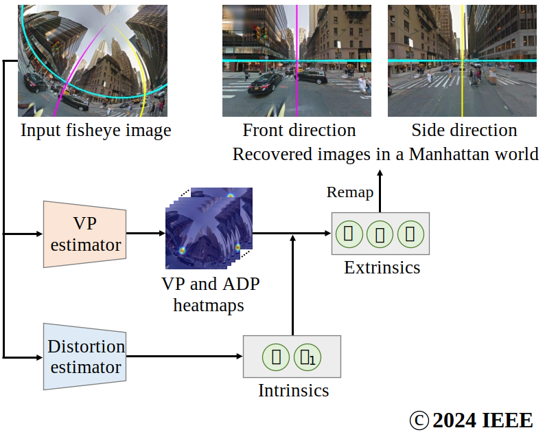
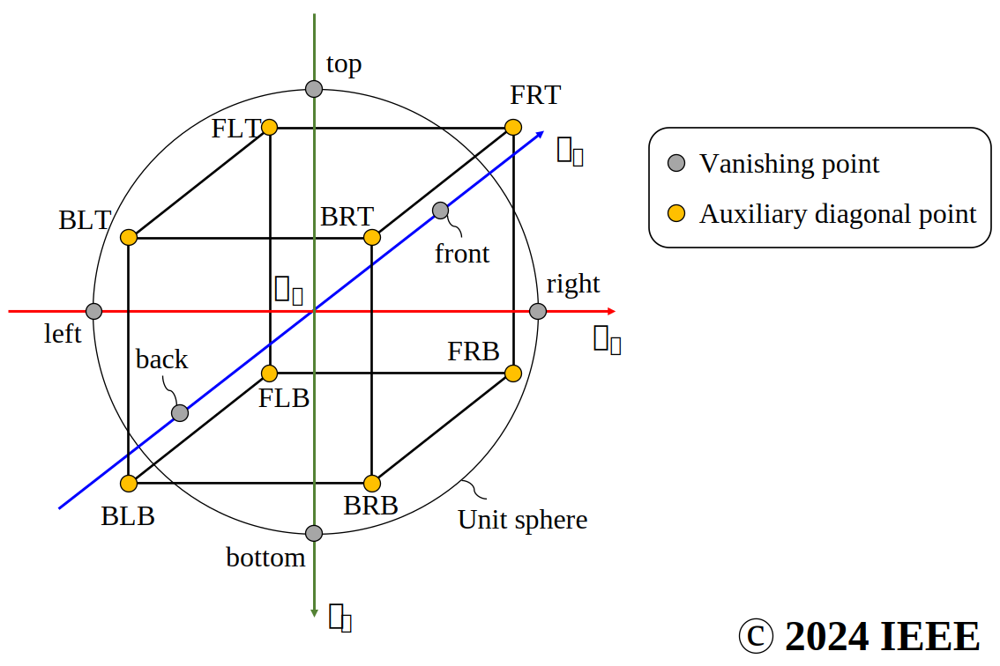
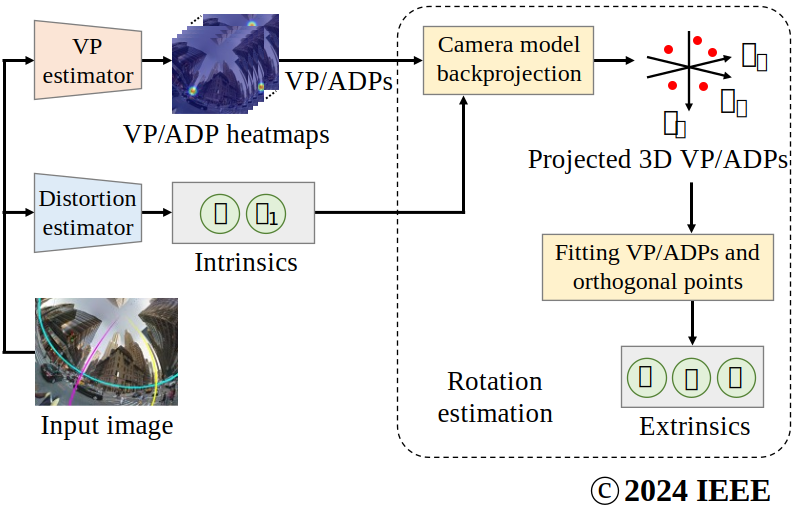
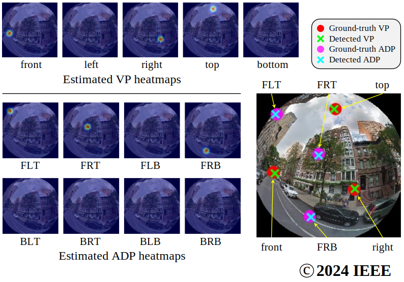
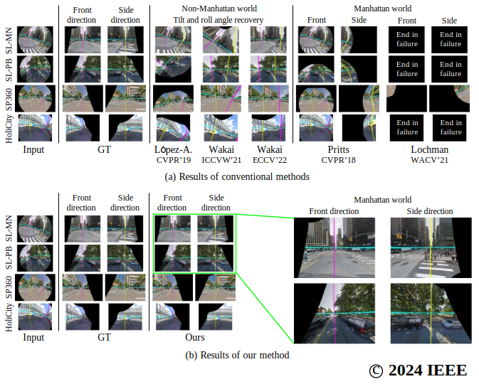
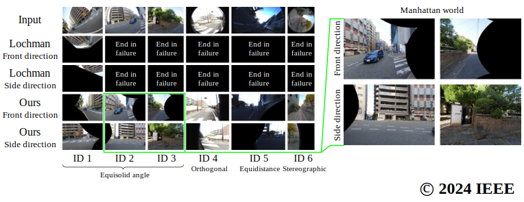

# Deep Single Image Camera Calibration by Heatmap Regression to Recover Fisheye Images Under Manhattan World Assumption

<p align="center">
  <a href="https://tech-ai.panasonic.com/en/researcher_introduction/050/">Nobuhiko Wakai </a><sup>1,*</sup>, 
  Satoshi Sato <sup>1</sup>, 
  <a href="https://tech-ai.panasonic.com/en/researcher_introduction/003/">Yasunori Ishii </a><sup>1</sup>, 
  <a href="http://mprg.cs.chubu.ac.jp/~takayoshi/">Takayoshi Yamashita </a><sup>2</sup><br>
  1 Panasonic Holdings, 2 Chubu University<br>
  * wakai.nobuhiko[at]jp.panasonic.com<br>
  <br>
  IEEE/CVF Conference on Computer Vision and Pattern Recognition (CVPR) 2024
</p>

日本語のプロジェクトページは[[こちら]](./README_jp.md)

## Abstract
<a href="https://tech-ai.panasonic.com/en/researcher_introduction/050/"></a>A Manhattan world lying along cuboid buildings is useful for camera angle estimation. However, accurate and robust angle estimation from fisheye images in the Manhattan world has remained an open challenge because general scene images tend to lack constraints such as lines, arcs, and vanishing points. To achieve higher accuracy and robustness, we propose a learning-based calibration method that uses heatmap regression, which is similar to pose estimation using keypoints, to detect the directions of labeled image coordinates. Simultaneously, our two estimators recover the rotation and remove fisheye distortion by remapping from a general scene image. Without considering vanishing-point constraints, we find that additional points for learning-based methods can be defined. To compensate for the lack of vanishing points in images, we introduce auxiliary diagonal points that have the optimal 3D arrangement of spatial uniformity. Extensive experiments demonstrated that our method outperforms conventional methods on large-scale datasets and with off-the-shelf cameras.

## Background
Camera calibration is used for various computer vision tasks to recover camera rotation and fisheye distortion. However, conventional geometric-based calibration methods need a calibration object, such as a plane or a cube. To address this problem, we use learning-based calibration methods called “Deep Single Image Camera Calibration.” Image-based angle estimation under Manhattan world assumption [12] is better for miniaturized and lightweight design for cars, drones, and robots. However, accurate and robust angle estimation has remained an open challenge because general scene images tend to lack constraints such as lines, arcs, and vanishing points (VPs).

## Contributions
- We propose a heatmap-based VP estimator for recovering the rotation from a single image to achieve higher accuracy and robustness than geometry-based methods using arc detectors.

- We introduce auxiliary diagonal points (ADPs) with an optimal 3D arrangement based on the spatial uniformity of regular octahedron groups to address the lack of VPs in an image.

## Proposed method
<p align="center">
  
</p>

**Fig. 1:** Our network estimates extrinsics and intrinsics in a Manhattan world from a single image. Our estimated camera parameters are used to fully recover images by remapping them while distinguishing the front and side directions on the basis of the Manhattan world. Cyan, magenta, and yellow lines indicate the three orthogonal planes of the Manhattan frame in each of the images. The input image is generated from [38]. This figure is referred to in our CVPR2024 Figure 1.
<br>
<br>

### Auxiliary diagonal points
<p align="center">
  
</p>

**Fig. 2:** Coordinates of VPs and ADPs in a Manhattan world. The labels of the VPs and ADPs correspond to the labels described in Table 1 of our paper. This figure is referred to in our CVPR2024 Figure 3.
<br>
<br>

Without considering the VP constraint that lines are concentrated at a VP, we can define various directions of points such as the vertexes of a polyhedron. We cannot escape the trade-off between the strength of constraints and the ease of training. This trade-off depends on the arrangement of the directions of points and the number of directions. To solve this problem concerning the arrangement and number of points, we define additional VP-related points called ADPs based on the spatial symmetry, see Figure 2.

### Network architecture
We found that VP estimation in images corresponds to single human pose estimation [2] in terms of labeled image-coordinate detection. Therefore, we propose a heatmap-regression network, called the "VP estimator," that detects image VP and ADPs (VP/ADPs) and is likely to avoid such degradation. For the intrinsics in [53], we use Wakai et al.'s calibration network [53] without the tilt and roll angle regressors, which is called the "distortion estimator." Therefore, our network has two estimators in Figure 1 and requires a single fisheye image.

### Training and inference
<p align="center">
  
</p>

**Fig. 3:** Calibration pipeline for inference. The intrinsics are estimated by the distortion estimator. Camera models project VP/ADPs onto the unit sphere using backprojection. The extrinsics are calculated from the fitting. The input fisheye image is generated from [38]. This figure is referred to in our CVPR2024 Figure 4.
<br>
<br>

Using the generated fisheye images with ground-truth camera parameters and VP/ADP labels, we train our two estimators independently. Figure 3 shows our calibration pipeline for inference. First, we obtain the image coordinates of VP/ADPs from the VP estimator and the intrinsics from the distortion estimator in Figure 3. Second, the detected VP/ADPs are projected onto a unit sphere in world coordinates using backprojection. This backprojection regards lens distortion using focal length and a distortion coefficient. Finally, we convert the 3D VP/ADPs to the extrinsics of pan, tilt, and roll angles by solving the absolute orientation problem [55].
<br>

## Experiments
We used three large-scale datasets of outdoor panoramas, the StreetLearn dataset [38], the SP360 dataset [9], and the HoliCity dataset [64]. In StreetLearn, we used the Manhattan 2019 subset (SL-MH) and the Pittsburgh 2019 subset (SL-PB). Following the procedure for dataset generation and capture [53], we generated fisheye images from panoramic images using the generic camera models with the ground-truth camera parameters, and we captured outdoor images in Kyoto, Japan, using six off-the-shelf fisheye cameras. Note that we removed label ambiguity and did not use back labels.
<br>

### Vanishing point estimation
<p align="center">
  
</p>

**Fig. 4:** Qualitative results of VP/ADP detection using the proposed VP estimator on the SL-MH test set. The VP estimator estimated five VP and eight ADP heatmaps for each VP/ADP. This figure is referred to in our CVPR2024 Figure 5.
<br>
<br>

Results of the cross-domain evaluation for our VP estimator using HRNet-W32
<table>
    <thead>
        <tr>
            <th align="center" class="tg-c3ow" colspan="2">Dataset</th>
            <th align="center" class="tg-c3ow" colspan="7">Keypoint metric &uarr;</th>
            <th align="center" class="tg-c3ow" colspan="8">Mean distance error [pixel] &darr;</th>
        </tr>
    </thead>
    <tr>
        <td>Train</td>
        <td>Test</td>
        <td>AP</td>
        <td>AP<sup>50</sup></td>
        <td>AP<sup>75</sup></td>
        <td>AR</td>
        <td>AR<sup>50</sup></td>
        <td>AR<sup>75</sup></td>
        <td>PCK</td>
        <td>front</td>
        <td>left</td>
        <td>right</td>
        <td>top</td>
        <td>bottom</td>
        <td>VP<sup>1</sup></td>
        <td>ADP<sup>1</sup></td>
        <td>All<sup>1</sup></td>
    </tr>
    <tr>
        <td rowspan="4">SL-MH</td>
        <td>SL-MH</td>
        <td>0.99</td>
        <td>0.99</td>
        <td>0.99</td>
        <td>0.97</td>
        <td>0.98</td>
        <td>0.98</td>
        <td>0.99</td>
        <td>2.67</td>
        <td>2.90</td>
        <td>2.52</td>
        <td>1.90</td>
        <td>1.72</td>
        <td>2.39</td>
        <td>3.64</td>
        <td>3.10</td>
    </tr>
    <tr>
        <td>SL-PB</td>
        <td>0.98</td>
        <td>0.99</td>
        <td>0.99</td>
        <td>0.96</td>
        <td>0.97</td>
        <td>0.97</td>
        <td>0.98</td>
        <td>3.51</td>
        <td>3.50</td>
        <td>3.11</td>
        <td>2.34</td>
        <td>2.02</td>
        <td>2.97</td>
        <td>4.52</td>
        <td>3.85</td>
    </tr>
    <tr>
        <td>SP360</td>
        <td>0.85</td>
        <td>0.94</td>
        <td>0.90</td>
        <td>0.79</td>
        <td>0.87</td>
        <td>0.83</td>
        <td>0.83</td>
        <td>6.55</td>
        <td>7.42</td>
        <td>6.18</td>
        <td>5.34</td>
        <td>11.77</td>
        <td>7.44</td>
        <td>14.95</td>
        <td>11.57</td>
    </tr>
    <tr>
        <td>HoliCity</td>
        <td>0.80</td>
        <td>0.92</td>
        <td>0.86</td>
        <td>0.72</td>
        <td>0.83</td>
        <td>0.78</td>
        <td>0.77</td>
        <td>9.73</td>
        <td>12.27</td>
        <td>9.75</td>
        <td>8.54</td>
        <td>6.60</td>
        <td>9.47</td>
        <td>17.92</td>
        <td>14.11</td>
    </tr>
</table>
<sup>1</sup> VP denotes all 5 VPs; ADP denotes all 8 ADPs; All denotes all points consisting of 5 VPs and 8 ADPs<br>
<br>

### Parameter and reprojection errors
Comparison of the absolute parameter errors and reprojection errors on the SL-MH test set
<table>
    <thead>
        <tr>
            <th align="center" class="tg-c3ow" rowspan="2" colspan="2">Method</th>
            <th align="center" class="tg-c3ow" rowspan="2">Backbone</th>
            <th align="center" class="tg-c3ow" colspan="5">Mean absolute error<sup>1</sup> &darr;</th>
            <th align="center" class="tg-c3ow" rowspan="2">REPE<sup>1</sup> &darr;</th>
            <th align="center" class="tg-c3ow" rowspan="2">Executable<br>rate<sup>1</sup> &uarr;</th>
            <th align="center" class="tg-c3ow" rowspan="2">Mean fps<sup>2</sup> &uarr;</th>
            <th align="center" class="tg-c3ow" rowspan="2">#Params</th>
            <th align="center" class="tg-c3ow" rowspan="2">GFLOPs</th>
        </tr>
        <tr>
            <th align="center" class="tg-c3ow">Pan <i>&phi;</i></th>
            <th align="center" class="tg-c3ow">Tilt <i>&theta;</i></th>
            <th align="center" class="tg-c3ow">Roll <i>&psi;</i></th>
            <th align="center" class="tg-c3ow"><i>f</i></th>
            <th align="center" class="tg-c3ow"><i>k</i><sub>1</sub></th>
        </tr>
    </thead>
    <tr>
        <td>López-Antequera et al. [33]</td>
        <td>CVPR&#39;19</td>
        <td>DenseNet-161</td>
        <td>–</td>
        <td>27.60</td>
        <td>44.90</td>
        <td>2.32</td>
        <td>–</td>
        <td>81.99</td>
        <td>100.0</td>
        <td>36.4</td>
        <td>27.4M</td>
        <td>7.2</td>
    </tr>
    <tr>
        <td>Wakai and Yamashita [52]</td>
        <td>ICCVW&#39;21</td>
        <td>DenseNet-161</td>
        <td>–</td>
        <td>10.70</td>
        <td>14.97</td>
        <td>2.73</td>
        <td>–</td>
        <td>30.02</td>
        <td>100.0</td>
        <td>33.0</td>
        <td>26.9M</td>
        <td>7.2</td>
    </tr>
    <tr>
        <td>Wakai et al. [53]</td>
        <td>ECCV&#39;22</td>
        <td>DenseNet-161</td>
        <td>–</td>
        <td>4.13</td>
        <td>5.21</td>
        <td>0.34</td>
        <td>0.021</td>
        <td>7.39</td>
        <td>100.0</td>
        <td>25.4</td>
        <td>27.4M</td>
        <td>7.2</td>
    </tr>
    <tr>
        <td>Pritts et al. [41]</td>
        <td>CVPR&#39;18</td>
        <td>–</td>
        <td>25.35</td>
        <td>42.52</td>
        <td>18.54</td>
        <td>–</td>
        <td>–</td>
        <td>–</td>
        <td>96.7</td>
        <td>0.044</td>
        <td>–</td>
        <td>–</td>
    </tr>
    <tr>
        <td>Lochman et al. [32]</td>
        <td>WACV&#39;21</td>
        <td>–</td>
        <td>22.36</td>
        <td>44.42</td>
        <td>33.20</td>
        <td>6.09</td>
        <td>–</td>
        <td>–</td>
        <td>59.1</td>
        <td>0.016</td>
        <td>–</td>
        <td>–</td>
    </tr>
    <tr>
        <td>Ours w/o ADPs</td>
        <td>(5 points)<sup>3</sup></td>
        <td>HRNet-W32<sup>3</sup></td>
        <td>19.38</td>
        <td>13.54</td>
        <td>21.65</td>
        <td>0.34</td>
        <td>0.020</td>
        <td>28.90</td>
        <td>100.0</td>
        <td>12.7</td>
        <td>53.5M</td>
        <td>14.5<sup>3</sup></td>
    </tr>
    <tr>
        <td>Ours w/o VPs</td>
        <td>(8 points)</td>
        <td>HRNet-W32</td>
        <td>10.54</td>
        <td>11.01</td>
        <td>8.11</td>
        <td>0.34</td>
        <td>0.020</td>
        <td>19.70</td>
        <td>100.0</td>
        <td>12.6</td>
        <td>53.5M</td>
        <td>14.5</td>
    </tr>
    <tr>
        <td>Ours</td>
        <td>(13 points)</td>
        <td>HRNet-W32<sup>3</sup></td>
        <td><b>2.20</b></td>
        <td><b>3.15</b></td>
        <td><b>3.00</b></td>
        <td>0.34</td>
        <td>0.020</td>
        <td><b>5.50</b></td>
        <td>100.0</td>
        <td>12.3</td>
        <td>53.5M</td>
        <td>14.5</td>
    </tr>
    <tr>
        <td>Ours</td>
        <td>(13 points)</td>
        <td>HRNet-W48</td>
        <td><b>2.19</b></td>
        <td><b>3.10</b></td>
        <td><b>2.88</b></td>
        <td>0.34</td>
        <td>0.020</td>
        <td><b>5.34</b></td>
        <td>100.0</td>
        <td>12.2</td>
        <td>86.9M</td>
        <td>22.1</td>
    </tr>
</table>
<sup>1</sup> Units: pan <i>&phi;</i>, tilt <i>&theta;</i>, and roll <i>&psi;</i> [deg]; <i>f</i> [mm]; <i>k</i><sub>1</sub> [dimensionless]; REPE [pixel]; Executable rate [%]
<br>
<sup>2</sup> Implementations: López-Antequera et al. [33], Wakai and Yamashita [52], Wakai et al. [53], and ours using PyTorch [40]; Pritts et al. [41] and Lochman et al. [32] using The MathWorks MATLAB
<br>
<sup>3</sup> (&middot; points) is the number of VP/ADPs for VP estimators; VP estimator backbones are indicated; Rotation estimation in Figure 3 is not included in GFLOPs
<br>

### Qualitative results on the synthesis images
<p align="center">
  
</p>

**Fig. 5:** Qualitative results on the test sets. (a) Results of conventional methods. From left to right: input images, ground truth (GT), and results of López-Antequera et al. [33], Wakai and Yamashita [52], Wakai et al. [53], Pritts et al. [41], and Lochman et al. [32]. (b) Results of our method. From left to right: input images, GT, and the results of our method using HRNet-W32 in a Manhattan world. This figure is referred to in our CVPR2024 Figure 6.
<br>
<br>

### Qualitative results on the off-the-shelf camera images
<p align="center">
  
</p>

**Fig. 6:** Qualitative results for images from off-the-shelf cameras. From top to bottom: input images, the results of the compared method (front and side direction images obtained by Lochman et al. [32]), and our method using HRNet-W32 (front and side direction images). The identifiers (IDs) correspond to the camera IDs used in [53], and the projection names are shown below the IDs. This figure is referred to in our CVPR2024 Figure 7.
<br>
<br>
These descriptions on this project page are referred to in our CVPR2024.

## Links
- CVPR2024: [[paper]](https://openaccess.thecvf.com/content/CVPR2024/papers/Wakai_Deep_Single_Image_Camera_Calibration_by_Heatmap_Regression_to_Recover_CVPR_2024_paper.pdf) [[supp]](https://openaccess.thecvf.com/content/CVPR2024/supplemental/Wakai_Deep_Single_Image_CVPR_2024_supplemental.pdf)
- arXiv: [[arXiv]](https://arxiv.org/abs/2303.17166)
- BibTex
```tex
@INPROCEEDINGS{Wakai_2024_CVPR,
    author    = {Wakai, Nobuhiko and Sato, Satoshi and Ishii, Yasunori and Yamashita, Takayoshi},
    title     = {Deep Single Image Camera Calibration by Heatmap Regression to Recover Fisheye Images Under Manhattan World Assumption},
    booktitle = {IEEE/CVF Conference on Computer Vision and Pattern Recognition (CVPR)},
    pages     = {11884-11894},
    year      = {2024}
}
```
- Related project
    * Nobuhiko Wakai and Takayoshi Yamashita. Deep Single Fisheye Image Camera Calibration for Over 180-degree Projection of Field of View. In International Conference on Computer Vision Workshop (ICCVW), pages 1174–1183, 2021. [[paper]](https://openaccess.thecvf.com/content/ICCV2021W/PBDL/papers/Wakai_Deep_Single_Fisheye_Image_Camera_Calibration_for_Over_180-Degree_Projection_ICCVW_2021_paper.pdf)
    * Nobuhiko Wakai and Satoshi Sato and Yasunori Ishii and Takayoshi Yamashita. Rethinking Generic Camera Models for Deep Single Image Camera Calibration to Recover Rotation and Fisheye Distortion. In European Conference on Computer Vision (ECCV), volume 13678, pages 679–698, 2022. [[paper]](https://www.ecva.net/papers/eccv_2022/papers_ECCV/papers/136780668.pdf) [[project]](https://github.com/panasonic-ai/rethinking-generic-camera-models)
- Press release [[press]](https://news.panasonic.com/global/press/en240605-5)

## References
- [2] M. Andriluka, L. Pishchulin, P. Gehler, and B. Schiele. 2D human pose estimation: New benchmark and state of the art analysis. In Proceedings of the IEEE Conference on Computer Vision and Pattern Recognition (CVPR), pages 3686–3693, 2014.
- [12] J. M. Coughlan and A. L. Yuille. Manhattan world: Compass direction from a single image by Bayesian inference. In Proceedings of the IEEE International Conference on Computer Vision (ICCV), pages 941–947, 1999.
- [32] Y. Lochman, O. Dobosevych, R. Hryniv, and J. Pritts. Minimal solvers for single-view lens-distorted camera auto-calibration. In Proceedings of the IEEE Winter Conference on Applications of Computer Vision (WACV), pages 2886–2895,2021.
- [33] M. López-Antequera, R. Marí, P. Gargallo, Y. Kuang, J. Gonzalez-Jimenez, and G. Haro. Deep single image camera calibration with radial distortion. In Proceedings of the IEEE/CVF Conference on Computer Vision and Pattern Recognition (CVPR), pages 11809–11817, 2019.
- [38] P. Mirowski, A. Banki-Horvath, K. Anderson, D. Teplyashin, K. M. Hermann, M. Malinowski, M. K. Grimes, K. Simonyan, K. Kavukcuoglu, A. Zisserman, and R. Hadsell. The StreetLearn environment and dataset. arXiv preprint arXiv:1903.01292, 2019.
- [40] A. Paszke, S. Gross, F. Massa, A. Lerer, J. Bradbury, G. Chanan, T. Killeen, Z. Lin, N. Gimelshein, L. Antiga, A. Desmaison, A. Köpf, E. Yang, Z. DeVito, M. Raison, A. Tejani, S. Chilamkurthy, B. Steiner, L. Fang, J. Bai, and S. Chintala. PyTorch: An imperative style, high-performance deep learning library. In Proceedings of the Advances in Neural Information Processing Systems (NeurIPS), pages 8024–8035, 2019.
- [41] J. Pritts, Z. Kukelova, V. Larsson, and O. Chum. Radially-distorted conjugate translations. In Proceedings of the IEEE/CVF Conference on Computer Vision and Pattern Recognition (CVPR), pages 1993–2001, 2018.
- [42] O. Russakovsky, J. Deng, H. Su, J. Krause, S. Satheesh, S. Ma, Z. Huang, A. Karpathy, A. Khosla, M. Bernstein, A. C. Berg, and L. Fei-Fei. ImageNet large scale visual recognition challenge. International Journal of Computer Vision (IJCV), 115(3):211–252, 2015.
- [52] N. Wakai and T. Yamashita. Deep single fisheye image camera calibration for over 180-degree projection of field of view. In Proceedings of the IEEE/CVF International Conference on Computer Vision Workshops (ICCVW), pages 1174–1183, 2021.
- [53] N. Wakai, S. Sato, Y. Ishii, and T. Yamashita. Rethinking generic camera models for deep single image camera calibration to recover rotation and fisheye distortion. In Proceedings of the European Conference on Computer Vision (ECCV), pages 679–698, 2022.
- [55] Z. Wang and Jepson. A new closed-form solution for absolute orientation. In Proceedings of the IEEE Conference on Computer Vision and Pattern Recognition (CVPR), pages 129–134, 1994.
