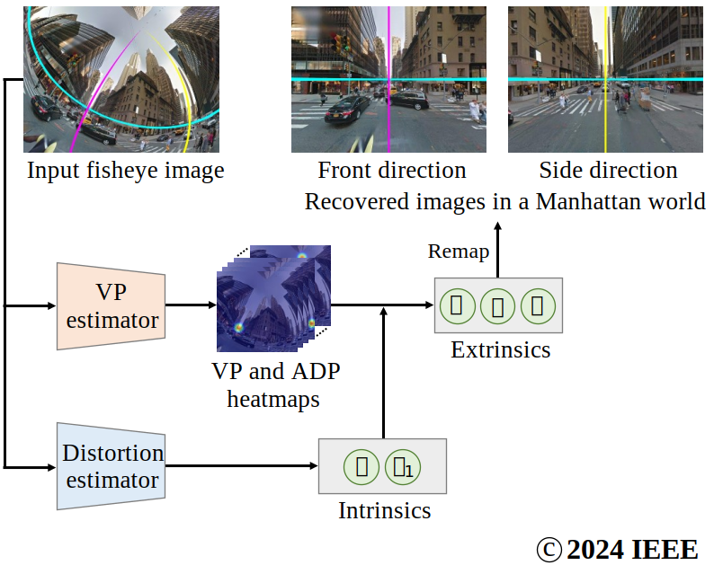
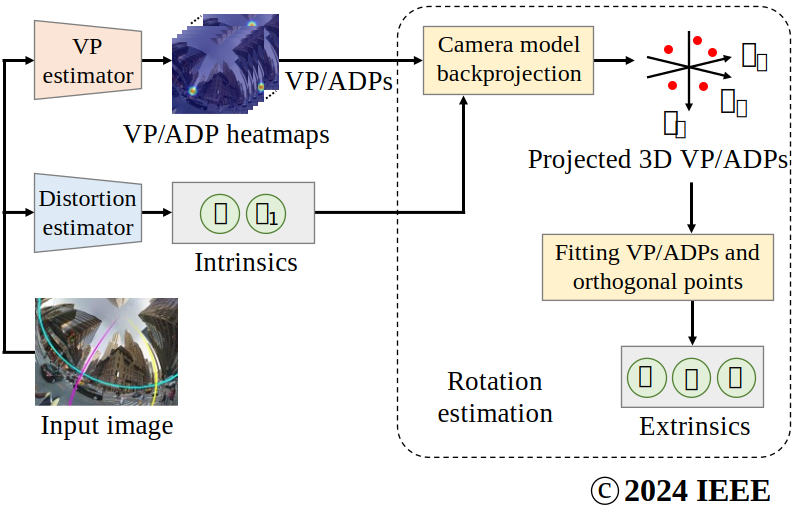
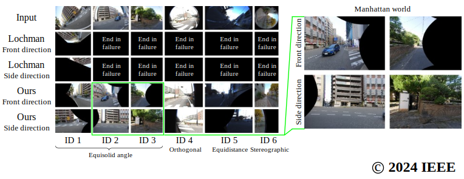

# Deep Single Image Camera Calibration by Heatmap Regression to Recover Fisheye Images Under Manhattan World Assumption

<p align="center">
  <a href="https://tech-ai.panasonic.com/jp/researcher_introduction/050/">若井 信彦 </a><sup>1,*</sup>, 
  佐藤 智 <sup>1</sup>, 
  <a href="https://tech-ai.panasonic.com/jp/researcher_introduction/003/">石井 育規 </a><sup>1</sup>, 
  <a href="http://mprg.cs.chubu.ac.jp/~takayoshi/">山下 隆義 </a><sup>2</sup><br>
  1 パナソニックホールディングス, 2 中部大学<br>
  * wakai.nobuhiko[at]jp.panasonic.com<br>
  <br>
  IEEE/CVF Conference on Computer Vision and Pattern Recognition (CVPR) 2024
</p>

English project page is [[here]](./README.md)

## 要旨
<a href="https://tech-ai.panasonic.com/jp/researcher_introduction/050/"></a>マンハッタン世界は直方体の建築物に沿った世界座標系であり、カメラの角度推定に適する。しかし、一般風景は直線、円弧、消失点などの拘束が不足しており、魚眼画像からのマンハッタン世界における正確かつ頑健な角度推定は未だに困難である。正確かつ頑健な推定を達成するため、ラベル付きの画像座標として方向を検出することは骨格推定におけるキーポイント検出と同様であり、ヒートマップを用いる学習ベースのカメラ校正法を提案する。２つの推定器は１枚の一般風景画像からリマップを通じて回転補正と魚眼歪みを除去する。消失点の拘束を考慮しないことで、学習ベース手法用に追加の特徴点を定義できる。画像中の消失点不足を補うため、三次元空間の一様性に関して最適配置となる補助対角点を導入する。大規模データセットと市販カメラを用いた広範な実験により提案法が従来法を上回る性能を示す。

## 背景
カメラ校正は様々なコンピュータビジョンのタスクでカメラの回転と魚眼歪みの補正に利用される。しかし、従来の幾何ベースのカメラ校正法は校正指標である板や直方体が必要であり、この課題に対して著者らは深層単画像カメラ校正と呼ばれる学習ベースの校正法を用いる。マンハッタン世界仮説 [2]における画像ベースの角度推定は自動車、ドローン、とロボットの小型軽量化に適する。しかし、直線、円弧、消失点 (VP) などの拘束力不足の傾向が一般風景画像にあるため、正確かつ頑健な角度推定は未だに困難である。

## 貢献
- 円弧検出器を用いる幾何ベースの従来法より高精度かつ頑健を達成するため、１枚の画像から回転補正するヒートマップに基づく消失点推定器を提案する。

- 画像中の消失点不足に対処するため、正八面体群に関する空間的な一様性に基づく最適な三次元配置を持つ補助対角点 (ADP) を導入する。

## 提案法
<p align="center">
  
</p>

**Fig. 1:** 提案ネットワークは１枚の画像からマンハッタン世界における外部と内部パラメータを推定する。推定されたカメラパラメータはマンハッタン世界に基づき正面と側面を区別したリマップ画像の完全な復元に使用される。シアン、マゼンタ、と黄色の直線は各画像におけるマンハッタンフレームの３つの直交平面を示す。入力画像は [38]から作成された。この画像は著名らの論文のFigure 1の引用である。
<br>
<br>

### 補助対角点
<p align="center">
  
</p>

**Fig. 2:** マンハッタン世界における消失点と補助対角点の座標。消失点と補助対角点のラベルは著者らの論文のTable 1に一致する。この画像は著名らの論文のFigure 3の引用である。
<br>
<br>

直線が画像中の一点に集中する消失点の拘束を考慮しないことで、正多面体の頂点方向などの様々な点を追加できる。拘束力と学習の容易さのトレードオフを避けることはできない。このトレードオフは点の方向の配置と点数に依存する。この配置と点数のトレードオフを解決するため、Figure 2に示す空間的な対称性に基づく補助対角点と呼ぶ追加点を定義する。

### ネットワーク構造
ラベル付きの画像座標検出に関して一人の骨格推定 [2]と消失点推定が一致することを見出した。したがって、円弧検出を使用することによる性能劣化を避け、ヒートマップに基づく消失点と補助対角点 (VP/ADP)の画像座標を検出する消失点推定器と呼ぶネットワークを提案する。内部パラメータ [53]の推定のため、歪み推定器と呼ぶ、チルト角とロール角の回帰を除いたWakai et al.の校正ネットワーク [53]を用いる。したがって、Figure 1に示す２つの推定器を持つネットワークは１枚の魚眼画像を入力として必要である。

### 学習と推論
<p align="center">
  
</p>

**Fig. 3:** 推論時の校正のパイプライン。歪み推定器は内部パラメータを推定する。消失点と補助対角点はカメラモデルを用いた逆投影により単位球面上に投影される。外部パラメータはフィッティングにより計算される。入力画像は [38]より作成された。この画像は著名らの論文のFigure 4の引用である。
<br>
<br>

作成した魚眼画像と真値のカメラパラメータと消失点と補助対角点ラベルを用いて、２つの推定器を独立に学習した。Figure 3に推論時の校正のパイプラインを示す。第一に、消失点と補助対角点の画像座標を消失点推定器で取得し、内部パラメータを歪み推定器で取得する。第二に、検出した消失点と補助対角点を逆投影により単位球面上の世界座標に投影する。この逆投影は焦点距離と歪み係数を用いたレンズ歪みを考慮する。最後に、絶対配向問題 [55]を解くことで三次元の消失点と補助対角点をパン角、チルト角、ロール角からなる外部パラメータに変換する。
<br>

## 実験
屋外パノラマの大規模データセットであるStreetLearnデータセット [38]、SP360データセット [9]、とHoliCityデータセット [64]を評価に用いた。StreetLearnにおいて、Manhattan 2019サブセット(SL-MH)とPittsburgh 2019サブセット(SL-PB)を用いた。データセット作成と撮影手順は [53]に従い, 真値のカメラパラメータと共にパノラマ画像から一般カメラモデルの魚眼画像を作成し、京都で6台の市販カメラで撮影を実施した。なお、ラベルの曖昧性を除去し、後方ラベルは使用しなかった。
<br>

### 消失点推定
<p align="center">
  
</p>

**Fig. 4:** SL-MHテストデータセットにおける提案消失点推定器の消失点と補助対角点の検出結果の定性評価結果。消失点推定器は５つの消失点と８つの補助対角点のヒートマップを消失点と補助対角点ごとに推定する。この画像は著名らの論文のFigure 5の引用である。
<br>
<br>

HRNet-W32を用いた消失点推定器のクロスドメイン評価結果
<table>
    <thead>
        <tr>
            <th align="center" class="tg-c3ow" colspan="2">Dataset</th>
            <th align="center" class="tg-c3ow" colspan="7">Keypoint metric &uarr;</th>
            <th align="center" class="tg-c3ow" colspan="8">Mean distance error [pixel] &darr;</th>
        </tr>
    </thead>
    <tr>
        <td>Train</td>
        <td>Test</td>
        <td>AP</td>
        <td>AP<sup>50</sup></td>
        <td>AP<sup>75</sup></td>
        <td>AR</td>
        <td>AR<sup>50</sup></td>
        <td>AR<sup>75</sup></td>
        <td>PCK</td>
        <td>front</td>
        <td>left</td>
        <td>right</td>
        <td>top</td>
        <td>bottom</td>
        <td>VP<sup>1</sup></td>
        <td>ADP<sup>1</sup></td>
        <td>All<sup>1</sup></td>
    </tr>
    <tr>
        <td rowspan="4">SL-MH</td>
        <td>SL-MH</td>
        <td>0.99</td>
        <td>0.99</td>
        <td>0.99</td>
        <td>0.97</td>
        <td>0.98</td>
        <td>0.98</td>
        <td>0.99</td>
        <td>2.67</td>
        <td>2.90</td>
        <td>2.52</td>
        <td>1.90</td>
        <td>1.72</td>
        <td>2.39</td>
        <td>3.64</td>
        <td>3.10</td>
    </tr>
    <tr>
        <td>SL-PB</td>
        <td>0.98</td>
        <td>0.99</td>
        <td>0.99</td>
        <td>0.96</td>
        <td>0.97</td>
        <td>0.97</td>
        <td>0.98</td>
        <td>3.51</td>
        <td>3.50</td>
        <td>3.11</td>
        <td>2.34</td>
        <td>2.02</td>
        <td>2.97</td>
        <td>4.52</td>
        <td>3.85</td>
    </tr>
    <tr>
        <td>SP360</td>
        <td>0.85</td>
        <td>0.94</td>
        <td>0.90</td>
        <td>0.79</td>
        <td>0.87</td>
        <td>0.83</td>
        <td>0.83</td>
        <td>6.55</td>
        <td>7.42</td>
        <td>6.18</td>
        <td>5.34</td>
        <td>11.77</td>
        <td>7.44</td>
        <td>14.95</td>
        <td>11.57</td>
    </tr>
    <tr>
        <td>HoliCity</td>
        <td>0.80</td>
        <td>0.92</td>
        <td>0.86</td>
        <td>0.72</td>
        <td>0.83</td>
        <td>0.78</td>
        <td>0.77</td>
        <td>9.73</td>
        <td>12.27</td>
        <td>9.75</td>
        <td>8.54</td>
        <td>6.60</td>
        <td>9.47</td>
        <td>17.92</td>
        <td>14.11</td>
    </tr>
</table>
<sup>1</sup> VPは５つ全ての消失点、ADPは８つ全ての補助対角点、Allは５つの消失点と８つの補助対角点からなる全ての点を示す<br>
<br>

### パラメータと再投影誤差
SL-MHテストデータセットにおけるパラメータの絶対値誤差と再投影誤差の比較
<table>
    <thead>
        <tr>
            <th align="center" class="tg-c3ow" rowspan="2" colspan="2">Method</th>
            <th align="center" class="tg-c3ow" rowspan="2">Backbone</th>
            <th align="center" class="tg-c3ow" colspan="5">Mean absolute error<sup>1</sup> &darr;</th>
            <th align="center" class="tg-c3ow" rowspan="2">REPE<sup>1</sup> &darr;</th>
            <th align="center" class="tg-c3ow" rowspan="2">Executable<br>rate<sup>1</sup> &uarr;</th>
            <th align="center" class="tg-c3ow" rowspan="2">Mean fps<sup>2</sup> &uarr;</th>
            <th align="center" class="tg-c3ow" rowspan="2">#Params</th>
            <th align="center" class="tg-c3ow" rowspan="2">GFLOPs</th>
        </tr>
        <tr>
            <th align="center" class="tg-c3ow">Pan <i>&phi;</i></th>
            <th align="center" class="tg-c3ow">Tilt <i>&theta;</i></th>
            <th align="center" class="tg-c3ow">Roll <i>&psi;</i></th>
            <th align="center" class="tg-c3ow"><i>f</i></th>
            <th align="center" class="tg-c3ow"><i>k</i><sub>1</sub></th>
        </tr>
    </thead>
    <tr>
        <td>López-Antequera et al. [33]</td>
        <td>CVPR&#39;19</td>
        <td>DenseNet-161</td>
        <td>–</td>
        <td>27.60</td>
        <td>44.90</td>
        <td>2.32</td>
        <td>–</td>
        <td>81.99</td>
        <td>100.0</td>
        <td>36.4</td>
        <td>27.4M</td>
        <td>7.2</td>
    </tr>
    <tr>
        <td>Wakai and Yamashita [52]</td>
        <td>ICCVW&#39;21</td>
        <td>DenseNet-161</td>
        <td>–</td>
        <td>10.70</td>
        <td>14.97</td>
        <td>2.73</td>
        <td>–</td>
        <td>30.02</td>
        <td>100.0</td>
        <td>33.0</td>
        <td>26.9M</td>
        <td>7.2</td>
    </tr>
    <tr>
        <td>Wakai et al. [53]</td>
        <td>ECCV&#39;22</td>
        <td>DenseNet-161</td>
        <td>–</td>
        <td>4.13</td>
        <td>5.21</td>
        <td>0.34</td>
        <td>0.021</td>
        <td>7.39</td>
        <td>100.0</td>
        <td>25.4</td>
        <td>27.4M</td>
        <td>7.2</td>
    </tr>
    <tr>
        <td>Pritts et al. [41]</td>
        <td>CVPR&#39;18</td>
        <td>–</td>
        <td>25.35</td>
        <td>42.52</td>
        <td>18.54</td>
        <td>–</td>
        <td>–</td>
        <td>–</td>
        <td>96.7</td>
        <td>0.044</td>
        <td>–</td>
        <td>–</td>
    </tr>
    <tr>
        <td>Lochman et al. [32]</td>
        <td>WACV&#39;21</td>
        <td>–</td>
        <td>22.36</td>
        <td>44.42</td>
        <td>33.20</td>
        <td>6.09</td>
        <td>–</td>
        <td>–</td>
        <td>59.1</td>
        <td>0.016</td>
        <td>–</td>
        <td>–</td>
    </tr>
    <tr>
        <td>Ours w/o ADPs</td>
        <td>(5 points)<sup>3</sup></td>
        <td>HRNet-W32<sup>3</sup></td>
        <td>19.38</td>
        <td>13.54</td>
        <td>21.65</td>
        <td>0.34</td>
        <td>0.020</td>
        <td>28.90</td>
        <td>100.0</td>
        <td>12.7</td>
        <td>53.5M</td>
        <td>14.5<sup>3</sup></td>
    </tr>
    <tr>
        <td>Ours w/o VPs</td>
        <td>(8 points)</td>
        <td>HRNet-W32</td>
        <td>10.54</td>
        <td>11.01</td>
        <td>8.11</td>
        <td>0.34</td>
        <td>0.020</td>
        <td>19.70</td>
        <td>100.0</td>
        <td>12.6</td>
        <td>53.5M</td>
        <td>14.5</td>
    </tr>
    <tr>
        <td>Ours</td>
        <td>(13 points)</td>
        <td>HRNet-W32<sup>3</sup></td>
        <td><b>2.20</b></td>
        <td><b>3.15</b></td>
        <td><b>3.00</b></td>
        <td>0.34</td>
        <td>0.020</td>
        <td><b>5.50</b></td>
        <td>100.0</td>
        <td>12.3</td>
        <td>53.5M</td>
        <td>14.5</td>
    </tr>
    <tr>
        <td>Ours</td>
        <td>(13 points)</td>
        <td>HRNet-W48</td>
        <td><b>2.19</b></td>
        <td><b>3.10</b></td>
        <td><b>2.88</b></td>
        <td>0.34</td>
        <td>0.020</td>
        <td><b>5.34</b></td>
        <td>100.0</td>
        <td>12.2</td>
        <td>86.9M</td>
        <td>22.1</td>
    </tr>
</table>
<sup>1</sup> 単位: Pan <i>&phi;</i>, Tilt <i>&theta;</i>, Roll <i>&psi;</i> [deg]; <i>f</i> [mm]; <i>k</i><sub>1</sub> [dimensionless]; REPE [pixel]; Executable rate [%]
<br>
<sup>2</sup> 実装: López-Antequera et al. [33], Wakai and Yamashita [52], Wakai et al. [53], 提案法はPyTorch [40]を使用し、Pritts et al. [41]とLochman et al. [32]はThe MathWorks MATLABを使用
<br>
<sup>3</sup> (&middot; points)は消失点推定器が用いる消失点と補助対角点の点数、消失点推定器のバックボーンを示し、Figure 3で示すRotation estimationはGFLOPsの計算に含めない
<br>

### 人工画像の定性評価
<p align="center">
  
</p>

**Fig. 5:** テストデータセットの定性評価結果。(a) 従来法の結果を示し、画像左から右に、入力画像、真値 (GT)、比較手法 (López-Antequera et al. [33]、Wakai and Yamashita [52]、Wakai et al. [53]、Pritts et al. [41]、とLochman et al. [32])。(b) 提案法の結果を示し、画像左から右に、入力画像、真値、マンハッタン世界におけるHRNet-W32を用いた提案法の結果。この画像は著名らの論文のFigure 6の引用である。
<br>
<br>

### 市販カメラ画像の定性評価
<p align="center">
  
</p>

**Fig. 6:** 市販カメラの定性評価結果。画像上から下に、入力画像、比較手法Lochman et. alの正面と側面画像、とHRNet-W32を用いた提案法の正面と側面画像。IDは [53]で使用されたカメラIDと一致し、IDの下に投影方式を示す。この画像は著名らの論文のFigure 7の引用である。
<br>
<br>
このプロジェクトページ内の説明は著者らのCVPR2024を引用して記載

## リンク
- CVPR2024: [[paper]](https://openaccess.thecvf.com/content/CVPR2024/papers/Wakai_Deep_Single_Image_Camera_Calibration_by_Heatmap_Regression_to_Recover_CVPR_2024_paper.pdf) [[supp]](https://openaccess.thecvf.com/content/CVPR2024/supplemental/Wakai_Deep_Single_Image_CVPR_2024_supplemental.pdf)
- arXiv: [[arXiv]](https://arxiv.org/abs/2303.17166)
- BibTex
```tex
@INPROCEEDINGS{Wakai_2024_CVPR,
    author    = {Wakai, Nobuhiko and Sato, Satoshi and Ishii, Yasunori and Yamashita, Takayoshi},
    title     = {Deep Single Image Camera Calibration by Heatmap Regression to Recover Fisheye Images Under Manhattan World Assumption},
    booktitle = {IEEE/CVF Conference on Computer Vision and Pattern Recognition (CVPR)},
    pages     = {11884-11894},
    year      = {2024}
}
```
- 関連プロジェクト
    * Nobuhiko Wakai and Takayoshi Yamashita. Deep Single Fisheye Image Camera Calibration for Over 180-degree Projection of Field of View. In International Conference on Computer Vision Workshop (ICCVW), pages 1174–1183, 2021. [[paper]](https://openaccess.thecvf.com/content/ICCV2021W/PBDL/papers/Wakai_Deep_Single_Fisheye_Image_Camera_Calibration_for_Over_180-Degree_Projection_ICCVW_2021_paper.pdf)
    * Nobuhiko Wakai and Satoshi Sato and Yasunori Ishii and Takayoshi Yamashita. Rethinking Generic Camera Models for Deep Single Image Camera Calibration to Recover Rotation and Fisheye Distortion. In European Conference on Computer Vision (ECCV), volume 13678, pages 679–698, 2022. [[paper]](https://www.ecva.net/papers/eccv_2022/papers_ECCV/papers/136780668.pdf) [[project]](https://github.com/panasonic-ai/rethinking-generic-camera-models/blob/main/README_jp.md)
- プレスリリース [[press]](https://news.panasonic.com/jp/press/jn240605-4)

## 参考文献
- [2] M. Andriluka, L. Pishchulin, P. Gehler, and B. Schiele. 2D human pose estimation: New benchmark and state of the art analysis. In Proceedings of the IEEE Conference on Computer Vision and Pattern Recognition (CVPR), pages 3686–3693, 2014.
- [12] J. M. Coughlan and A. L. Yuille. Manhattan world: Compass direction from a single image by Bayesian inference. In Proceedings of the IEEE International Conference on Computer Vision (ICCV), pages 941–947, 1999.
- [32] Y. Lochman, O. Dobosevych, R. Hryniv, and J. Pritts. Minimal solvers for single-view lens-distorted camera auto-calibration. In Proceedings of the IEEE Winter Conference on Applications of Computer Vision (WACV), pages 2886–2895,2021.
- [33] M. López-Antequera, R. Marí, P. Gargallo, Y. Kuang, J. Gonzalez-Jimenez, and G. Haro. Deep single image camera calibration with radial distortion. In Proceedings of the IEEE/CVF Conference on Computer Vision and Pattern Recognition (CVPR), pages 11809–11817, 2019.
- [38] P. Mirowski, A. Banki-Horvath, K. Anderson, D. Teplyashin, K. M. Hermann, M. Malinowski, M. K. Grimes, K. Simonyan, K. Kavukcuoglu, A. Zisserman, and R. Hadsell. The StreetLearn environment and dataset. arXiv preprint arXiv:1903.01292, 2019.
- [40] A. Paszke, S. Gross, F. Massa, A. Lerer, J. Bradbury, G. Chanan, T. Killeen, Z. Lin, N. Gimelshein, L. Antiga, A. Desmaison, A. Köpf, E. Yang, Z. DeVito, M. Raison, A. Tejani, S. Chilamkurthy, B. Steiner, L. Fang, J. Bai, and S. Chintala. PyTorch: An imperative style, high-performance deep learning library. In Proceedings of the Advances in Neural Information Processing Systems (NeurIPS), pages 8024–8035, 2019.
- [41] J. Pritts, Z. Kukelova, V. Larsson, and O. Chum. Radially-distorted conjugate translations. In Proceedings of the IEEE/CVF Conference on Computer Vision and Pattern Recognition (CVPR), pages 1993–2001, 2018.
- [42] O. Russakovsky, J. Deng, H. Su, J. Krause, S. Satheesh, S. Ma, Z. Huang, A. Karpathy, A. Khosla, M. Bernstein, A. C. Berg, and L. Fei-Fei. ImageNet large scale visual recognition challenge. International Journal of Computer Vision (IJCV), 115(3):211–252, 2015.
- [52] N. Wakai and T. Yamashita. Deep single fisheye image camera calibration for over 180-degree projection of field of view. In Proceedings of the IEEE/CVF International Conference on Computer Vision Workshops (ICCVW), pages 1174–1183, 2021.
- [53] N. Wakai, S. Sato, Y. Ishii, and T. Yamashita. Rethinking generic camera models for deep single image camera calibration to recover rotation and fisheye distortion. In Proceedings of the European Conference on Computer Vision (ECCV), pages 679–698, 2022.
- [55] Z. Wang and Jepson. A new closed-form solution for absolute orientation. In Proceedings of the IEEE Conference on Computer Vision and Pattern Recognition (CVPR), pages 129–134, 1994.
